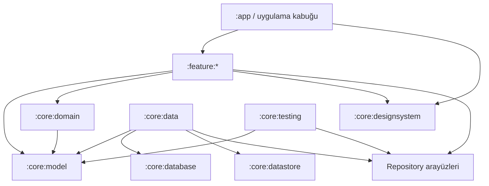

# Nefes İzi — Proje İncelemesi ve Hedef Mimari

> Yaşayan mimari belgesi<br>
> İlk inceleme: 27 Temmuz 2026<br>
> Uygulama durumu güncellemesi: 28 Temmuz 2026<br>
> Kapsam: Mevcut Android projesi, kullanıcı tarafından sağlanan 1.032 satırlık ürün gereksinimi, hedef mimari, veri güvenilirliği ve sağlık iletişimi

## 1. Yönetici özeti

Proje Empty Activity tabanından çalışan bir local-first ürün çekirdeğine taşınmıştır. Mevcut uygulamada Room, DataStore, Hilt, Navigation Compose, modern tema, onboarding, hızlı kayıt, kayıt arşivi, günlük sağlık formu, temel analiz ve ayarlar ekranları çalışmaktadır.

Son doğrulanan komutlar:

- `./gradlew assembleDebug`: başarılı
- `./gradlew testDebugUnitTest`: başarılı
- `./gradlew lintDebug`: başarılı

Uygulama kullanılabilir bir dikey dilime sahiptir; ancak tam ürün yönetimi, yürürlük tarihli fiyat geçmişi, kayıt detay düzenleme, gelişmiş analiz, yedekleme, bildirim, biyometrik kilit ve kapsamlı test matrisi tamamlanmadan release adayı değildir.

Önerilen yaklaşım:

1. Yürürlük tarihli ürün revizyonu ve fiyat snapshot sözleşmesi uygulanmalı.
2. Ürün yönetimi ile kayıt detay/düzenleme akışları tamamlanmalı.
3. Maliyet, gelişmiş analiz ve sağlık karşılaştırmaları test edilebilir domain kurallarına taşınmalı.
4. Yedekleme, bildirim, biyometrik kilit ve release kalite kapıları tamamlanmalı.

Ayrıntılı ve güncel uygulama sırası için `docs/IMPLEMENTATION_ROADMAP.md` esas alınır. Bu belgenin devamındaki hedef mimari bölümleri kararların gerekçesini korur; ilk incelemeye ait envanter satırları tarihsel başlangıç durumunu gösterebilir.

Bu ürün için “local-first”, yerel verinin bir önbellek olması değil, **tek ve nihai doğruluk kaynağı olması** anlamına gelir. Room kayıt ve sağlık verilerinin; DataStore ise küçük kullanıcı tercihleri ile özellik ayarlarının kaynağı olmalıdır.

## 2. İncelenen kaynaklar

### 2.1 Yerel proje

- `settings.gradle.kts`
- kök `build.gradle.kts`
- `gradle/libs.versions.toml`
- `app/build.gradle.kts`
- `AndroidManifest.xml`
- `MainActivity.kt`
- Material 3 tema dosyaları
- yedekleme ve data extraction XML dosyaları
- örnek unit ve instrumented testler
- Gradle wrapper ve daemon JVM ayarları

### 2.2 Ürün gereksinimi

İncelenen gereksinim; hızlı kayıt, ürün snapshot'ı, nullable emisyon değerleri, sağlık günlüğü, dönemsel analiz, kural tabanlı içgörü, maliyet, yerel yedekleme, bildirim, biyometrik kilit, erişilebilirlik, validasyon ve kapsamlı test beklentilerini içerir.

Bu belge gereksinim metnini yeniden yazmak yerine, onu uygulanabilir teknik kararlara dönüştürür.

## 3. Mevcut durum envanteri

| Alan | Mevcut durum | Değerlendirme |
|---|---|---|
| Modüller | Tek `:app`, net `core/feature/ui` paket sınırları | MVP için yeterli; ihtiyaç halinde modülerleştirilebilir |
| UI | Onboarding ve beş ana sekme çalışıyor | Gelişmiş alt akışlar yol haritasında |
| Compose | Material 3 ve Compose BOM | Aktif |
| Tema | Özel açık/koyu editorial tema | Sistem/açık/koyu seçimli |
| Veri | Room v2 ve Preferences DataStore | Ürün revizyonu için v3 sırada |
| DI | Hilt | Aktif |
| Navigasyon | Navigation Compose, beş alt sekme | Aktif |
| Arka plan işi | WorkManager yok | Bildirim zamanlaması yok |
| Güvenlik | Biyometrik akış yok | Hassas günlük verileri için eksik |
| İnternet | `INTERNET` izni yok | Gereksinimle uyumlu; korunmalı |
| Android backup | `allowBackup="false"` | Local-first vaadiyle uyumlu |
| `minSdk` | 26 | Hedef cihaz kapsamıyla uyumlu |
| `targetSdk` | 36 | Güncel tabana yakın |
| Java hedefi | 17 | Uyumlu |
| Testler | Domain unit testleri; migration/DAO/UI kapsamı sırada | Genişletilmeli |
| Git | Git deposu mevcut | Faz bazlı anlamlı commit politikası uygulanmalı |

### 3.1 Sürüm kataloğu gözlemi

Compose BOM yeni görünürken `core-ktx`, Lifecycle, Activity, AndroidX Test ve Espresso sürümleri belirgin biçimde daha eskidir. Yeni bağımlılıklar eklenmeden önce sürümler tek bir uyumluluk geçişinde güncellenmelidir. 27 Temmuz 2026 tarihli resmi AndroidX kararlı kanalında örneğin Room `2.8.4`, DataStore `1.2.1` ve WorkManager `2.11.2` listelenmektedir. Sürüm seçimi yapılırken yalnızca “en yeni” olmak değil; AGP, Kotlin, KSP, Compose ve Hilt uyumluluğu birlikte doğrulanmalıdır.

Kaynak: [AndroidX kararlı sürümler](https://developer.android.com/jetpack/androidx/versions/stable-channel)

## 4. İlk teknik kararlar

### 4.1 Minimum SDK

Öneri: **minSdk 26**.

Gerekçe:

- `java.time` API doğrudan kullanılabilir.
- Bildirim kanalları bu seviyeden itibaren vardır.
- Compose, Room, WorkManager, DataStore ve AndroidX Biometric ile uyumludur.
- `minSdk 33` cihaz erişimini gereksiz biçimde sınırlar.
- Android 13 bildirim izni gibi yeni sürüm davranışları koşullu ele alınabilir.

Ürün yalnızca çok yeni cihazları hedefleyen kapalı bir dağıtım değilse 33 için mevcut bir iş gerekçesi yoktur.

### 4.2 JVM hedefi

Öneri: Gradle daemon JDK 21 ile çalışabilir; Android derleme hedefi ve Kotlin `jvmTarget` **17** olarak hizalanmalıdır. Mevcut Java 11 hedefi yükseltilirken tüm compile seçenekleri aynı değerde tutulmalıdır.

### 4.3 Modülerleşme

Bu kapsam tek devasa `app` modülünde uzun süre tutulmamalıdır. Bununla birlikte her küçük sınıf için modül açmak da gereksiz derleme ve bakım maliyeti yaratır.

Önerilen dengeli yapı:

```text
:app
:core:model
:core:database
:core:datastore
:core:data
:core:domain
:core:designsystem
:core:testing
:feature:onboarding
:feature:today
:feature:records
:feature:health
:feature:analytics
:feature:products
:feature:settings
:feature:backup
```

İlk dikey dilimde `feature:settings` ve `feature:backup` daha sonra açılabilir; fakat paket ve API sınırları baştan bu yapıya göre kurulmalıdır.

### 4.4 Mimari stili

“Clean Architecture’a yakın” burada her işlem için üç anlamsız sarmalayıcı katman oluşturmak anlamına gelmemelidir.

- UI: Compose ekranı, immutable `UiState`, `UiAction`, tek seferlik `UiEffect`, ViewModel.
- Domain: yalnızca tekrar kullanılan veya gerçekten iş kuralı taşıyan use-case ve saf hesaplayıcılar.
- Data: repository implementasyonları, transaction koordinasyonu ve mapper'lar.
- Local source: Room DAO ve Proto DataStore.

UI hiçbir zaman DAO veya DataStore'a doğrudan erişmez. Basit salt-okuma akışlarında ViewModel repository'yi doğrudan kullanabilir; snapshot oluşturma, hızlı kayıt, geri alma, dönem karşılaştırma ve insight üretme gibi kurallar use-case olmalıdır.

Bu yaklaşım Android'in resmi UI/data katmanı, repository, unidirectional data flow ve gerektiğinde domain katmanı önerileriyle uyumludur:

- [Android uygulama mimarisi rehberi](https://developer.android.com/topic/architecture)
- [Android mimari önerileri](https://developer.android.com/topic/architecture/recommendations)
- [Domain katmanı rehberi](https://developer.android.com/topic/architecture/domain-layer)

## 5. Hedef bağımlılık yönü



Kurallar:

- Feature modülleri birbirine doğrudan bağımlı olmaz.
- Navigasyon hedefleri uygulama kabuğunda veya küçük navigation API sözleşmelerinde birleştirilir.
- `core:database` UI tipi bilmez.
- `core:model` Android framework sınıflarına bağlı olmaz.
- Repository arayüzleri tüketiciye yakın, implementasyonlar `core:data` içinde tutulur.
- WorkManager worker'ları repository/use-case kullanır; DAO'yu doğrudan çağırmaz.

## 6. Paket sınırları

Her feature için önerilen iç yapı:

```text
feature/today/
├── TodayRoute.kt
├── TodayScreen.kt
├── TodayViewModel.kt
├── TodayContract.kt
├── components/
└── navigation/
```

Veri katmanı:

```text
core/data/
├── repository/
├── mapper/
├── transaction/
├── backup/
└── di/
```

Domain:

```text
core/domain/
├── calculation/
├── insight/
├── usecase/record/
├── usecase/analytics/
├── time/
└── validation/
```

“util” isimli genel bir çekmece yerine sınıflar anlamlarına göre `time`, `format`, `validation`, `serialization` gibi paketlerde tutulmalıdır.

## 7. Veri modelleme kararları

### 7.1 Kimlikler

Öneri: dışa aktarma, birleştirme ve mükerrer kayıt kontrolü için entity kimlikleri **UUID metni** olsun. Yalnızca cihaz içinde artan `Long` kimlikler JSON yedekleri birleştirilirken çakışır.

### 7.2 Zaman

Sigara kayıtlarında:

- `smokedAtEpochMillis: Long`
- `zoneIdSnapshot: String`
- `createdAtEpochMillis: Long`
- `updatedAtEpochMillis: Long`

saklanması önerilir.

`Instant` mutlak anı, `zoneIdSnapshot` ise kayıt oluşturulduğundaki yerel gösterimi korur. Kullanıcı seyahat ettiğinde geçmiş kayıtların başka güne kayması engellenir.

“Gün başlangıç saati” ayarı nedeniyle DAO'ya yalnızca takvim tarihi verilmemeli; domain katmanı seçilen gün için `[startInclusive, endExclusive)` an aralığını üretmelidir. Yaz/kış saati geçişleri sabit 24 saat eklenerek değil, `ZonedDateTime.plusDays(1)` ile hesaplanmalıdır.

`DailyHealthEntry` bir kullanıcı-günü için tek kayıt olmalıdır. Anahtar olarak hesaplanmış `entryDate` ve benzersiz indeks kullanılabilir; kayıtla birlikte o günün zone bilgisi de korunmalıdır.

### 7.3 Ondalık değerler

SQLite `REAL` ile doğrudan para ve emisyon toplamı yapmak kayan nokta sürprizleri doğurabilir.

Öneri:

- Emisyon: mikrogram cinsinden `Long`; ekranda mg/g olarak dönüştür.
- Para: para biriminin alt biriminden daha hassas hesap için `priceMicros: Long` ve `currencyCode: String`.
- İçilen oran: veritabanında `consumedQuarter: Int` (`1..4`), domain/API'de `0.25..1.0`.
- Adet: pozitif `Int`.

Bu temsiller toplama işlemlerini deterministik yapar. Kullanıcının locale uyumlu ondalık girişi önce normalize edilir, sonra sabit ölçekli domain değerine çevrilir.

### 7.4 Ürün snapshot'ı

`SmokingRecordEntity`, ürünün kayıt anındaki şu alanlarını bağımsız saklamalıdır:

- ad
- sigara başı nikotin, katran, CO
- sigara başı fiyat ve para birimi
- değer kaynağı

`productId` nullable bir referanstır; hesaplamanın kaynağı değildir. Ürün güncellendiğinde geçmiş kayıt değişmez. Ürün varsayılan olarak silinmez, arşivlenir. Gerçek silme gerekiyorsa ilişki `ON DELETE SET NULL` olabilir; snapshot korunur.

Hızlı kayıt işlemi tek bir Room transaction içinde:

1. varsayılan ürünü okur,
2. güncel değerlerden snapshot üretir,
3. kaydı ekler,
4. oluşturulan UUID'yi döndürür.

Snackbar “Geri Al” işlemi bu UUID'yi hedefler. Genel bir “son kaydı sil” sorgusu eşzamanlı işlemlerde yanlış kaydı silebilir.

### 7.5 Önerilen tablolar

#### `cigarette_products`

Gereksinimdeki alanlara ek olarak `currencyCode`, sabit ölçekli değerler ve değer kaynağını içerir. Aynı anda yalnızca bir aktif varsayılan ürün olması repository transaction'ıyla korunur.

#### `smoking_records`

Snapshot alanları, opsiyonel bağlam alanları, zone bilgisi ve audit zamanları içerir. `productId`, `smokedAtEpochMillis`, tetikleyici ve ürün adına uygun indeksler eklenir.

Serbest metin araması veri büyüdüğünde Room FTS tablosuna taşınabilir. İlk sürümde indeksli ürün adı + sınırlı `LIKE` araması kabul edilebilir; karar gerçek veri hacmiyle ölçülmelidir.

#### `daily_health_entries`

Enerji, stres ve uyku kalitesi `1..5`; belirtiler nullable boolean; nabız, tansiyon, kilo ve egzersiz nullable sayısal alanlardır. “Girilmedi” ile “hayır” aynı değer olmamalıdır; bu nedenle belirti alanlarında null desteklenmelidir.

#### `user_goals`

İlk sürümde hedef özelliği gerçekten sunulmayacaksa tablo baştan eklenmemelidir. YAGNI uygulanmalı; bildirim metninde hedef özeti yer alacaksa hedefin semantiği önce ürün kararı olarak tanımlanmalıdır.

#### App metadata

Onboarding, tema, görünür kartlar, para birimi, gün başlangıcı ve bildirim tercihleri Proto DataStore'da tutulabilir. Veritabanı şema sürümü Room'un kendi mekanizmasındadır. Tam yedek format sürümü ise export manifestinde tutulmalıdır.

## 8. Repository sözleşmeleri

Önerilen ana sözleşmeler:

- `ProductRepository`
  - aktif ürünleri gözlemle
  - ürün ekle/güncelle/arşivle
  - varsayılanı transaction ile değiştir
- `SmokingRecordRepository`
  - tarih aralığını gözlemle
  - hızlı kayıt ekle
  - manuel/geçmiş kayıt ekle
  - düzenle, çoğalt, sil, geri yükle
- `HealthRepository`
  - kullanıcı-günü kaydını gözlemle
  - upsert et
  - dönem verisini getir
- `SettingsRepository`
  - typed preferences akışı
  - atomik ayar güncellemeleri
- `BackupRepository`
  - sürümlü JSON dışa aktar/içe aktar
  - CSV paketini üret
- `NotificationScheduler`
  - benzersiz WorkManager işlerini aç/kapat/güncelle

Repository'ler nullable emisyonu sıfıra çevirmemelidir.

## 9. Hesaplama sözleşmesi

Tek kayıt için bilinen bir değer:

```text
effectiveQuantity = quantity × consumedRatio
estimatedEmission = effectiveQuantity × emissionPerCigaretteSnapshot
estimatedCost = effectiveQuantity × pricePerCigaretteSnapshot
```

Toplam sonucu yalnızca sayı olarak döndürmek yetersizdir. Önerilen domain sonucu:

```kotlin
data class CoverageAwareTotal<T>(
    val value: T?,
    val knownCigaretteEquivalent: BigDecimal,
    val unknownCigaretteEquivalent: BigDecimal,
    val knownRecordCount: Int,
    val unknownRecordCount: Int,
)
```

Kullanıcı metninde “7 sigara üzerinden” ifadesi geçtiği için hem kayıt sayısı hem etkili sigara adedi tutulmalıdır. `quantity > 1` olduğunda “10 kaydın 7'si” ile “12 sigaranın 10'u” aynı şey değildir.

Kurallar:

- Değer yoksa toplamda `0` gibi davranılmaz.
- Hiç bilinen değer yoksa `value = null`; UI “Hesaplanamadı” gösterir.
- Yüzde değişim için önceki dönem sıfırsa sonsuz yüzde üretilmez; açıklayıcı özel durum döndürülür.
- Ortalama aralık için en az iki olay gerekir.
- `quantity > 1` tek timestamp'te birden çok olay gibi yapay sıfır aralıklar üretmemelidir; aralık analizi kayıt zamanları üzerinden yapılır ve toplu kayıt olduğu belirtilir.
- En düşük tüketimli gün hesabına kayıt olmayan günlerin dahil edilip edilmeyeceği ürün kararıdır. Öneri: seçilen dönemdeki tüm kullanıcı-günleri dahil edilir ve “0 kayıtlı gün” açıkça adlandırılır.
- “İlk sigaraya kadar geçen süre” için uyanma zamanı verisi yoktur. Sağlık günlüğüne opsiyonel `wakeTime` eklenmeden bu metrik üretilemez. Yalnızca gün başlangıcından ilk kayda kadar süre, uyanıştan sonraki süre diye sunulmamalıdır.

## 10. UI ve durum yönetimi

Her ekran:

- immutable `UiState`,
- kullanıcı niyetini anlatan `UiAction`,
- snackbar/navigasyon/dosya seçici gibi tek seferlik `UiEffect`,
- `StateFlow` üreten ViewModel

kullanır.

Compose fonksiyonları:

- hesaplama ve repository çağrısı yapmaz,
- state render eder,
- action yollar,
- lifecycle-aware state toplar,
- erişilebilirlik semantiğini taşır.

Navigasyon:

- beş kök hedef: Bugün, Kayıtlar, Sağlık, Analiz, Ayarlar,
- onboarding ana grafikten önce,
- ürün düzenleme, kayıt detayı, backup gibi ikincil hedefler kök barı göstermeyebilir,
- typed route kullanılmalı,
- entity nesnesi route içine koyulmamalı; yalnızca UUID taşınmalı,
- süreç ölümünde form state'i için `SavedStateHandle` kullanılmalı.

## 11. Hızlı kayıt ve çift dokunma güvenliği

Sabit bir debounce bütün art arda kayıtları engellememelidir. Önerilen davranış:

- UI, insert tamamlanana kadar butonda çok kısa bir “işleniyor” durumu gösterir.
- Aynı UI action aynı anda ikinci coroutine başlatmaz (`Mutex` veya tek-flight).
- Başarılı işlemden hemen sonra buton tekrar kullanılabilir.
- İsteğe bağlı 800–1200 ms içinde aynı ürün için ikinci dokunuşta “Bir kayıt daha eklensin mi?” gibi düşük sürtünmeli doğrulama değerlendirilebilir; bu ürün testi gerektirir.
- Veritabanı işlemi kendine ait UUID ile idempotent izlenebilir.

## 12. Gerçek zamanlı süre

“Son sigaradan beri” göstergesi:

- ekran görünürken dakika sınırına hizalı bir Flow ile güncellenir,
- arka planda timer çalıştırmaz,
- her frame veya her saniye recomposition yapmaz,
- uygulama tekrar öne geldiğinde saatten yeniden hesaplanır.

WorkManager bu iş için uygun değildir; kesin dakikalık UI timer'ı değildir.

## 13. Sağlık verisi ve bilimsel iletişim

### 13.1 Bilimsel olarak savunulabilir temel

1. Tütün kullanımı için güvenli bir maruziyet düzeyi gösterilmemelidir. WHO, tüm tütün biçimlerinin zararlı olduğunu ve güvenli maruziyet düzeyi bulunmadığını belirtir.  
   Kaynak: [WHO — Tobacco and nicotine](https://www.who.int/news-room/fact-sheets/detail/tobacco)

2. Paket veya standart makine ölçümü kişisel emilim değildir. İnsanların nefes hacmi, sıklığı, derinliği, filtre ventilasyonunu kapatma davranışı ve metabolizması farklıdır.  
   Kaynaklar: [NCI — “Light” Cigarettes and Cancer Risk](https://www.cancer.gov/about-cancer/causes-prevention/risk/tobacco/light-cigarettes-fact-sheet), [WHO FCTC rehberi](https://iris.who.int/bitstream/handle/10665/75218/9789241501316_eng.pdf)

3. Düşük makine ölçümlü “light/low tar” ürünler daha güvenli olarak sunulamaz. Biyobelirteç çalışmaları, nominal düşük katran değerinin daha düşük kişisel nikotin ve karsinojen maruziyetini güvenilir biçimde göstermediğini bulmuştur.  
   Akademik kaynak: [Xiao ve arkadaşları, 2010, Tobacco Control](https://pubmed.ncbi.nlm.nih.gov/20507920/)

4. İçme biçimi maruziyeti değiştirir. Smoking topography çalışmaları puff sayısı, süresi, hacmi ve hızında kişiler arası farklılık bulunduğunu; bunların kişisel maruziyetle ilişkili olduğunu gösterir.  
   Akademik kaynaklar: [Djordjevic ve arkadaşlarının alanını değerlendiren derleme](https://pmc.ncbi.nlm.nih.gov/articles/PMC2789355/), [Ross ve arkadaşları, 2016](https://pmc.ncbi.nlm.nih.gov/articles/PMC4811367/)

5. Olay anına yakın mobil kayıt, retrospektif günlük toplamıyla eşdeğer değildir ve daha ayrıntılı zaman/bağlam verisi sağlar. Bu, “tek dokunuşla kaydet, detayı sonra ekle” tasarımını destekler; yine de öz-bildirimin laboratuvar ölçümü olmadığı açık kalmalıdır.  
   Akademik kaynaklar: [Ozga ve arkadaşları, 2022](https://pubmed.ncbi.nlm.nih.gov/33630647/), [Shiffman, 2009 yöntem karşılaştırması](https://pubmed.ncbi.nlm.nih.gov/19808861/), [EMA sistematik derleme ve meta-analizi](https://pmc.ncbi.nlm.nih.gov/articles/PMC9704370/)

### 13.2 Uygulamada kullanılabilecek çekirdek metinler

**Kısa kart açıklaması**

> Kayıtlı ürün değerlerinden hesaplanan tahmini duman emisyonu. Gerçek kişisel emilim miktarı değildir.

**Detaylı bilgi**

> Gösterilen değerler, kaydettiğin ürünlerde bulunan veya senin girdiğin sigara başı emisyon değerlerinin matematiksel toplamıdır. İçme şekli, nefes derinliği, filtre kullanımı, ürün farklılıkları ve kişisel metabolizma nedeniyle gerçek maruziyet değişebilir. Bu değerler kandaki nikotin veya karbonmonoksit düzeyini ya da vücutta biriken katranı göstermez ve tıbbi değerlendirme değildir.

**Güvenli düzey uyarısı**

> Tütün dumanı için güvenli kabul edilen bir maruziyet düzeyi yoktur. Renkler yalnızca kendi kayıtlı geçmişinle karşılaştırmayı gösterir; sağlık açısından güvenli veya tehlikeli bir sınır göstermez.

**Sağlık günlüğü ilişkisi**

> Bu görünüm yalnızca kendi kayıtların arasındaki birlikte değişimi gösterir. Neden-sonuç ilişkisi kurmaz, teşhis koymaz ve ölçülmemiş etkenleri hesaba katamaz.

### 13.3 Terminoloji kararı

Gereksinimde geçen “tahmini nikotin/katran/CO emisyonu” ifadesi korunmalıdır. Daha kısa ekranlarda yalnızca “nikotin” yazılmamalıdır; bu, vücudun aldığı doz gibi anlaşılabilir.

Kullanılmaması gereken sunumlar:

- “Akciğerinde biriken katran”
- “Kanındaki CO”
- “Aldığın nikotin”
- “Güvenli/sağlıklı miktar”
- “Düşük riskli ürün”
- belirtilerin sigaradan kaynaklandığını söyleyen nedensel metin

### 13.4 Sağlık günlüğü analiz eşiği

“7 veya 14 gün” tek başına bilimsel geçerlilik eşiği değildir; ürünün yanlış kesinlik üretmesini azaltan bir gösterim kuralıdır.

Öneri:

- En az 14 tamamlanmış kullanıcı-günü olmadan sağlık ilişkisi cümlesi üretme.
- Her karşılaştırılan grupta en az 5 gün olmasını iste.
- Eksik günlükleri “belirti yok” sayma.
- Yalnızca etki yönü ve örneklem kapsamını göster; p-değeri veya klinik risk etiketi üretme.
- Çoklu metrik taramasından “en güçlü ilişki” seçip kesin içgörü gibi sunma.
- Her sonuçta veri aralığını ve gün sayısını göster.

Örnek:

> Son 21 gündeki kayıtlarında, baş ağrısı işaretlediğin 6 günde ortalama 11,2; işaretlemediğin 12 günde 8,7 sigara kaydı var. 3 günde sağlık kaydı yok. Bu yalnızca kayıtların arasındaki ilişkidir ve neden-sonuç göstermez.

### 13.5 Belirti ve ölçüm validasyonu

Sağlık alanlarında uygulama klinik sınıflandırma yapmamalıdır.

- Nabız, tansiyon ve kilo için negatif/sıfır değer engellenir.
- Aşırı görünen değerlerde kayıt engellemek yerine açık bir doğrulama ve tekrar kontrol önerisi gösterilir.
- Uygulama “normal/yüksek/düşük” teşhis etiketi üretmez.
- Ölçüm birimi alanın yanında ve export içinde açıkça saklanır.
- Belirti alanları üç durumlu olmalıdır: girilmedi / hayır / evet.
- Göğüs rahatsızlığı veya nefes darlığı için uygulama nedensellik kurmaz. Acil yardım metni ileride eklenecekse ülke, klinik içerik sahibi ve güncelleme süreci belirlenmeden hard-code edilmemelidir.

## 14. Insight engine sınırları

Insight engine saf, deterministik ve açıklanabilir kurallardan oluşmalıdır. Her insight şu bilgileri taşımalıdır:

- `type`
- `period`
- `minimumDataSatisfied`
- hesaplamada kullanılan pay/payda
- kullanıcı metni
- zorunlu caveat
- öncelik

Önerilen korumalar:

- Yüzde karşılaştırma için iki tam ve eş uzunlukta dönem.
- En az 7 gün ve yeterli kayıt olmadan trend üretmeme.
- Tetikleyici yüzdesinin paydası yalnızca tetikleyici girilmiş kayıtlar ise bunu söyleme; tüm kayıtlar ise eksik oranını ayrıca gösterme.
- Saat diliminde seyahat kayıtlarını `zoneIdSnapshot` ile yerel saate dönüştürme.
- “Belirgin artış” gibi ifadeleri sayısal eşik tanımlanmadan kullanmama.
- Aynı anda birbiriyle çelişen insight'ları önceliklendirme.

Bu motor sağlık tavsiyesi değil, kayıt özeti üretir.

## 15. Gizlilik, yedekleme ve güvenlik

### 15.1 Android otomatik yedekleme

Manifestteki mevcut `android:allowBackup="true"` ve boş şablon kurallar, “veriler yalnızca cihazda” ifadesiyle uyumlu değildir. Sağlık günlüğü de bulunduğu için öneri:

- `android:allowBackup="false"` ile sistem bulut yedeklemesini kapatmak,
- yedeklemeyi yalnızca kullanıcının başlattığı Storage Access Framework export akışıyla yapmak,
- gizlilik metninde cihazlar arası otomatik aktarım olmadığını açıklamak.

Eğer ileride Android cihaz aktarımı desteklenmek istenirse bulut yedeği ile cihazdan cihaza aktarım ayrı tehdit modeliyle ve açık kurallarla ele alınmalıdır.

### 15.2 İnternet

- Manifestte `INTERNET` izni eklenmemeli.
- Analytics, crash reporting, reklam veya uzaktan config SDK'sı eklenmemeli.
- CI'da merged manifest üzerinde internet izni kontrolü yapılabilir.

### 15.3 Biyometrik kilit

Biyometrik kilit bir şifreleme sistemiyle aynı şey değildir. İlk sürümde:

- `BiometricPrompt` ile uygulama erişimi kapatılır,
- arka plana geçiş zamanı process içinde ve gerekli tercih DataStore'da tutulur,
- belirlenen timeout sonrası yeniden doğrulama istenir,
- cihaz desteği ve kayıtlı biyometri yokluğu ayrı durumlar olarak gösterilir,
- hassas içerik son uygulamalar ekranında bulanıklaştırma/`FLAG_SECURE` ürün kararı olarak değerlendirilir.

Veritabanı şifreleme isteniyorsa bunun ayrı bir anahtar yönetimi ve kurtarma tasarımı gerekir; “biyometrik kilit var” diye veri-at-rest şifreli kabul edilmemelidir.

### 15.4 Dışa aktarma

Tam JSON yedeği:

```text
backupVersion
exportedAt
appVersion
schemaVersion
products[]
smokingRecords[]
dailyHealthEntries[]
settings
```

Kurallar:

- Önce tüm dosya parse ve validate edilir, sonra transaction başlar.
- “Üzerine yaz” seçeneği destructive olduğu için açık ikinci onay ister.
- “Birleştir” UUID üzerinden çalışır; çakışma politikası kullanıcıya özetlenir.
- Import başarısızsa mevcut veri değişmeden kalır.
- Bilinmeyen yeni alanlar ileri uyumluluk için tolere edilebilir; zorunlu alan ve desteklenmeyen ana sürüm reddedilir.
- CSV analiz içindir; tam geri yüklemenin kaynağı JSON'dur.
- CSV formula injection'a karşı `=`, `+`, `-`, `@` ile başlayan kullanıcı metinleri güvenli biçimde escape edilir.
- Export dosyası hassas veri içerdiğini belirten kullanıcı uyarısıyla paylaşılır.

## 16. Room ve migration stratejisi

- Şema export'u ilk sürümden itibaren source control'e alınır.
- Destructive migration kullanılmaz.
- İlk yayın `version = 1` olabilir; örnek migration üretmek için yapay bir kolon eklenmez.
- Bunun yerine migration test altyapısı ve şema snapshot'ı ilk günden kurulur.
- İlk gerçek şema değişikliğinde `1 → 2` migration ve veri koruma testi aynı PR'da gelir.
- DAO testleri Android cihaz/emülatör üzerinde çalışır.

Room'un resmi rehberi şema geçmişinin saklanmasını ve migration'ların test edilmesini önerir; destructive fallback kullanıcı verisini kalıcı olarak silebilir:

- [Room migration rehberi](https://developer.android.com/training/data-storage/room/migrating-db-versions)
- [Room veritabanı test rehberi](https://developer.android.com/training/data-storage/room/testing-db)

## 17. Bildirim planı

- Bildirimler varsayılan kapalı.
- Android 13+ izni yalnızca kullanıcı bir bildirim özelliğini açtığında istenir.
- Her bildirim tipi benzersiz WorkManager adı kullanır.
- Ayar değişince eski iş iptal edilip yenisi planlanır.
- Saat dilimi/saat değişikliğinde plan yeniden değerlendirilir.
- WorkManager kesin saate alarm garantisi vermez; UI bunu “yaklaşık saat” olarak sunar.
- Bildirim içeriğinde kilit ekranında hassas veri gösterimi için kullanıcı tercihi düşünülmelidir.

## 18. Tasarım ve erişilebilirlik ilkeleri

- Ana “Sigara İçtim” butonu başparmak erişim bölgesinde, en az 48 dp dokunma alanında.
- Kaydı oluşturmadan önce form açılmaz; detay sonradan eklenir.
- Renk tüketimi sağlık açısından sınıflandırmaz.
- Her grafik yanında aynı bilgiyi anlatan metinsel özet bulunur.
- Dynamic Color kapatılabilir.
- Font scale büyüdüğünde kartlar sabit yüksekliğe kilitlenmez.
- TalkBack sıralaması görsel sırayla uyumludur.
- “84 mg” tek başına okunmaz; semantik metin “Tahmini katran emisyonu 84 miligram, 12 sigaranın 10'u üzerinden” olur.
- Snackbar aksiyonları yeterli süre ve erişilebilir semantik taşır.
- Hata metni yalnızca renkle anlatılmaz.

## 19. Test piramidi ve kabul kapıları

### 19.1 Saf unit testler

- emisyon ve maliyet hesapları
- nullable kapsam ve bilinmeyen sayıları
- quantity/consumed ratio
- sabit ölçek dönüşümleri ve locale input
- gün başlangıcı ve DST
- dönem karşılaştırmaları, sıfır paydayı ele alma
- aralık metrikleri ve toplu kayıt davranışı
- insight eşikleri ve caveat üretimi
- sağlık verisi yeterlilik kuralları
- snapshot değişmezliği

### 19.2 Repository ve DAO testleri

- ürün varsayılanını atomik değiştirme
- hızlı kayıt transaction'ı
- arşiv ve geçmiş kayıt koruması
- `[start, end)` gün sorguları
- Flow güncellemeleri
- import transaction rollback
- UUID çakışma politikası
- migration doğrulama

### 19.3 ViewModel testleri

- loading/content/empty/error durumları
- hızlı kayıt ve tek-flight koruması
- geri alma için doğru UUID
- varsayılan ürün yok akışı
- effect tekrar tüketimi
- SavedStateHandle form geri yükleme

### 19.4 Compose testleri

- onboarding atlama ve ürün oluşturma
- hızlı kayıt, snackbar, geri al, detay ekle
- manuel ürün
- boş nullable alanlarla kayıt
- bottom navigation state restoration
- font scale ve temel accessibility semantics
- tema ve dynamic color ayarı

### 19.5 CI kapıları

Her değişiklikte en az:

```bash
./gradlew assembleDebug
./gradlew testDebugUnitTest
./gradlew lintDebug
```

Veri şeması değişikliklerinde instrumented DAO/migration testleri; release adayı için ayrıca release build ve tam connected test paketi çalıştırılmalıdır.

## 20. Uygulama sırası

### Aşama 0 — Temel kararlar

- package/application adlandırmasını netleştir
- minSdk 26 ve JVM 17 hizalaması
- sürüm kataloğu uyumluluk güncellemesi
- modül iskeleti, Hilt ve test convention'ları
- manifest backup kararı

### Aşama 1 — Güvenilir veri çekirdeği

- domain modelleri ve value object'ler
- Room entity/DAO/database
- Proto DataStore
- repository sözleşmeleri ve implementasyonları
- snapshot transaction'ı
- hesaplama ve migration test temeli

### Aşama 2 — İlk tamamlanmış dikey dilim

- onboarding
- ürün ekleme ve varsayılan ürün
- Bugün ekranı
- tek dokunuşla kayıt
- geri alma ve detay ekleme
- gerçek zamanlı süre

Bu aşamanın sonunda uygulama gerçek bir temel kullanım senaryosunu uçtan uca tamamlamalıdır.

### Aşama 3 — Kayıt yönetimi

- günlere göre liste
- arama/filtre
- düzenle, sil, çoğalt
- geçmiş kayıt ekleme

### Aşama 4 — Sağlık ve analiz

- DailyHealthEntry
- coverage-aware toplamlar
- grafikler ve metinsel özetler
- dönem karşılaştırmaları
- açıklanabilir insight engine

### Aşama 5 — Cihaz özellikleri

- bildirimler
- biyometrik kilit
- JSON/CSV export
- validate-then-transaction import
- tüm verileri güvenli silme

### Aşama 6 — Üretim sertleştirme

- accessibility audit
- process death ve timezone/DST testleri
- büyük veri performansı
- backup round-trip ve bozuk dosya testleri
- release shrink/optimization
- gizlilik ve sağlık metni içerik incelemesi

## 21. Açık ürün kararları

Uygulama kodlanmadan önce aşağıdaki semantik kararlar ürün sahibi tarafından netleştirilmelidir:

1. Özel gün başlangıcı geçmiş analizlere bugünkü ayarla mı, kayıt anındaki ayarla mı uygulanacak?
2. Kullanıcı seyahat ettiğinde günlük gruplama kayıt yerel saatini mi, mevcut cihaz saatini mi kullanacak? Öneri: kayıt zone snapshot'ı.
3. `quantity > 1` toplu kaydı aralık analizinde tek olay mı sayılacak? Öneri: tek zaman olayı.
4. “İlk sigaraya kadar süre” hangi başlangıca göre? Uyanma saati yoksa bu metrik gereksinimden çıkarılmalı veya `wakeTime` eklenmeli.
5. Sağlık belirtileri her gün üç durumlu mu olacak: girilmedi/hayır/evet? Öneri: evet.
6. Para birimi ürün/kayıt snapshot'ında mı, yalnızca global ayarda mı? Öneri: snapshot'ta ISO 4217 kodu.
7. Biyometrik kilit yalnızca UI kapısı mı, yoksa veritabanı şifreleme de kapsamda mı?
8. JSON import birleştirmede aynı UUID ve farklı içerik varsa hangi kayıt kazanacak?
9. Otomatik Android cihaz aktarımı “yalnızca cihazda” ilkesinin parçası olarak kabul ediliyor mu?

## 22. Bilinen riskler

| Risk | Etki | Azaltma |
|---|---|---|
| Emisyonun kişisel doz gibi anlaşılması | Sağlık açısından yanıltıcı iletişim | Her kartta “tahmini emisyon”, erişilebilir açıklama ve kaynaklı caveat |
| Nullable değerin sıfıra dönüşmesi | Yanlış düşük toplam | Coverage-aware sonuç tipi ve unit test |
| Ürün düzenlemenin geçmişi değiştirmesi | Veri güveni kaybı | Kayıt snapshot'ı ve değişmezlik testi |
| Saat dilimi/DST | Yanlış günlük toplam | Instant + zone snapshot + `ZonedDateTime` testleri |
| Android cloud backup | Gizlilik vaadi ihlali | `allowBackup=false`, kullanıcı kontrollü export |
| Yedek importunda kısmi yazma | Veri bozulması | Önce doğrula, tek Room transaction |
| Aşırı modülerleşme | Yavaş geliştirme | Dengeli core/feature sınırları, küçük convention seti |
| Yetersiz sağlık verisinden insight | Sahte kesinlik | Minimum veri ve grup kapsamı, zorunlu caveat |
| Çift dokunma | İstenmeyen kayıt | Tek-flight işlem, hedefli geri alma |
| Export spreadsheet injection | CSV açıldığında güvenlik riski | Tehlikeli hücre öneklerini escape et |

## 23. “Bitti” tanımı

Bir özellik ancak şu koşullarda tamamlanmış sayılır:

- kalıcı veri ve process death davranışı tanımlı,
- loading/empty/content/error durumları var,
- TalkBack ve büyük font davranışı gözden geçirilmiş,
- sağlık/maliyet metni belirsiz değil,
- unit veya uygun katman testi var,
- hata ve geri alma davranışı var,
- build, test ve lint başarılı,
- yeni Room şeması varsa migration yolu ve testi var,
- yeni hassas veri varsa export/backup/gizlilik etkisi değerlendirilmiş.

## 24. Sonuç

Empty Activity tabanı temiz ve derlenebilir; ancak ürün açısından henüz başlangıç çizgisindedir. En kritik iş, ekranları hızla çoğaltmak değil; snapshot semantiği, nullable veri kapsamı, zaman bölgeleri, sağlık iletişimi ve kullanıcı kontrollü yedekleme üzerine güvenilir bir veri çekirdeği kurmaktır.

İlk geliştirme hedefi “bütün sekmeler görünüyor” değil, **ürün oluştur → tek dokunuşla kaydet → doğru snapshot ile sakla → geri al → bugünkü toplamı coverage bilgisiyle göster** dikey diliminin testli ve erişilebilir biçimde tamamlanması olmalıdır.
